# MySQL MCP Server Architecture

This document provides detailed architecture diagrams for the MySQL MCP Server.

## Table of Contents

- [High-Level Architecture](#high-level-architecture)
- [Component Structure](#component-structure)
- [Request Flow](#request-flow)
  - [MCP Mode](#mcp-mode-stdio)
  - [HTTP REST API Mode](#http-rest-api-mode)
- [Configuration Loading](#configuration-loading)
- [Connection Management](#connection-management)
- [Tool Categories](#tool-categories)

---

## High-Level Architecture

The MySQL MCP Server acts as a bridge between AI clients and MySQL databases, supporting both MCP protocol (stdio) and HTTP REST API modes.

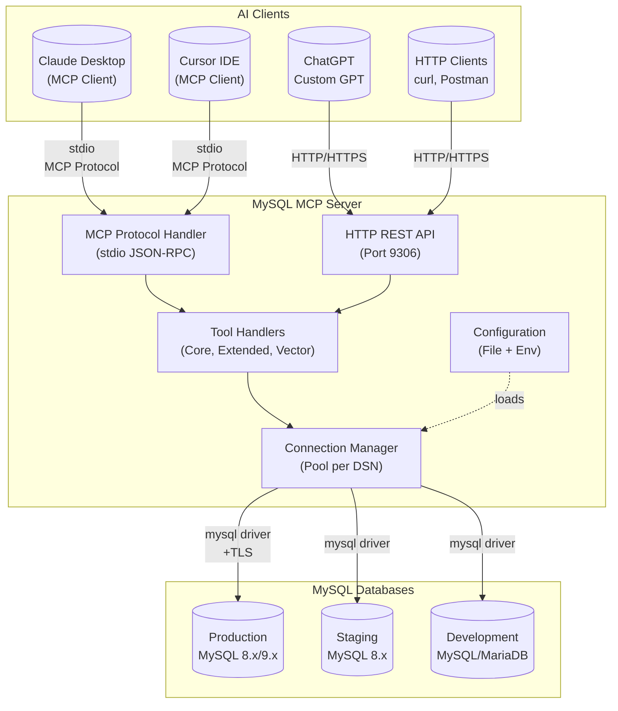

---

## Component Structure

The codebase is organized into clear packages with specific responsibilities.

```mermaid
graph TB
    subgraph "cmd/mysql-mcp-server"
        main["main.go<br/>Entry point, MCP server setup"]
        tools["tools.go<br/>Core tool handlers"]
        toolsExt["tools_extended.go<br/>Extended tool handlers"]
        http["http.go<br/>REST API handlers"]
        conn["connection.go<br/>Connection manager"]
        types["types.go<br/>Input/output types"]
        logging["logging.go<br/>Structured logging"]
        tokenEst["token_estimator.go<br/>Token counting"]
    end
    
    subgraph "internal/config"
        config["config.go<br/>Config loading"]
        file["file.go<br/>File config parser"]
    end
    
    subgraph "internal/mysql"
        client["client.go<br/>MySQL client wrapper"]
    end
    
    subgraph "internal/api"
        middleware["middleware.go<br/>HTTP middleware"]
        ratelimit["ratelimit.go<br/>Rate limiter"]
        response["response.go<br/>Response helpers"]
    end
    
    subgraph "internal/util"
        validator["sql_validator.go<br/>SQL validation"]
        parser["sql_parser.go<br/>SQL parsing"]
        identifiers["identifiers.go<br/>Identifier quoting"]
    end
    
    main --> tools
    main --> toolsExt
    main --> http
    main --> conn
    tools --> types
    toolsExt --> types
    http --> types
    
    main --> config
    config --> file
    
    conn --> client
    tools --> client
    toolsExt --> client
    
    http --> middleware
    http --> ratelimit
    http --> response
    
    tools --> validator
    tools --> parser
    tools --> identifiers
```

---

## Request Flow

### MCP Mode (stdio)

In MCP mode, the server communicates via stdin/stdout using JSON-RPC.

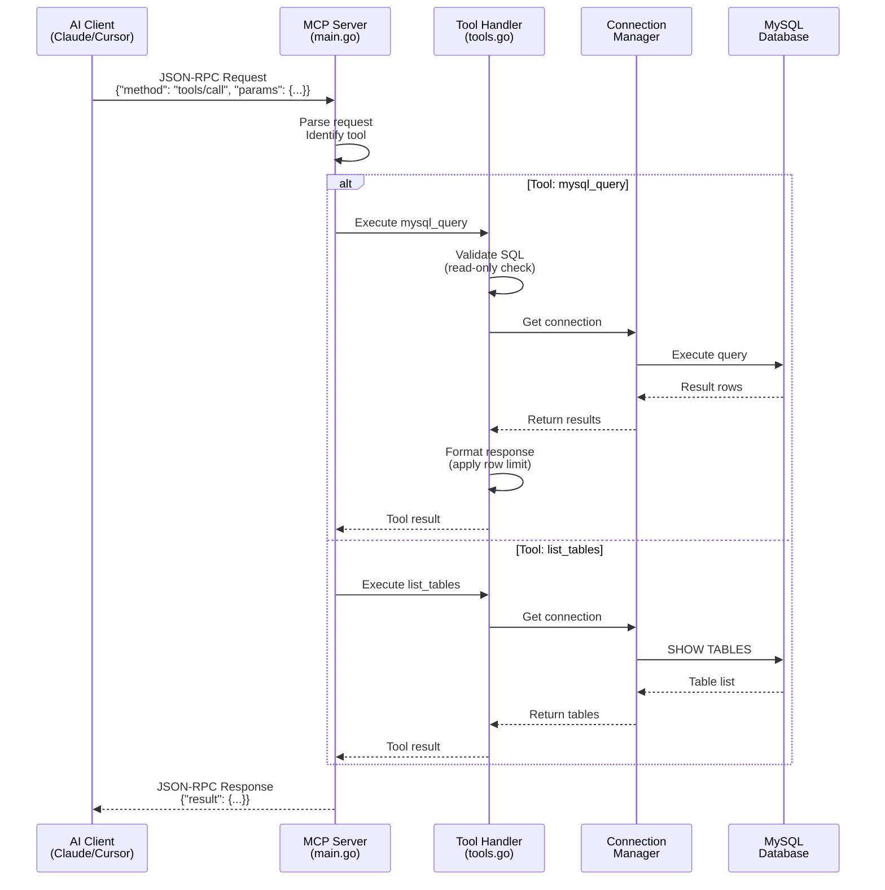

### HTTP REST API Mode

In HTTP mode, the server exposes RESTful endpoints.

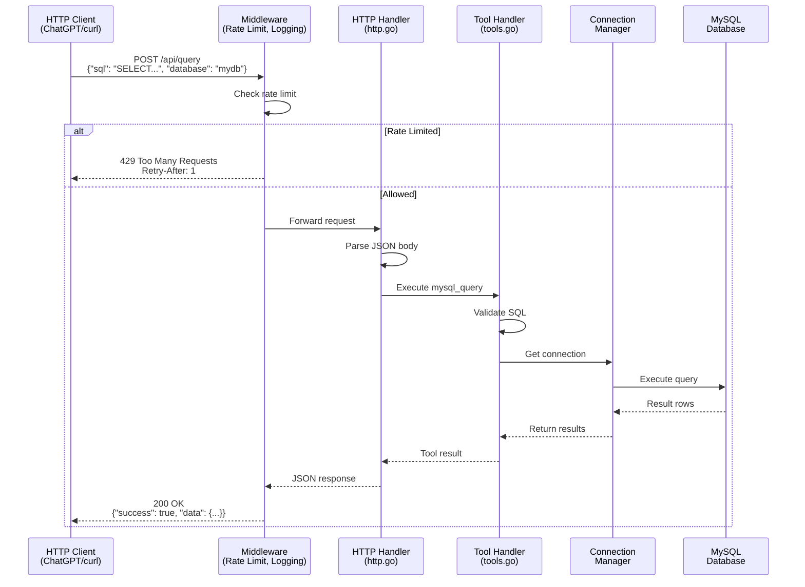

---

## Configuration Loading

Configuration is loaded from multiple sources with a clear priority order.

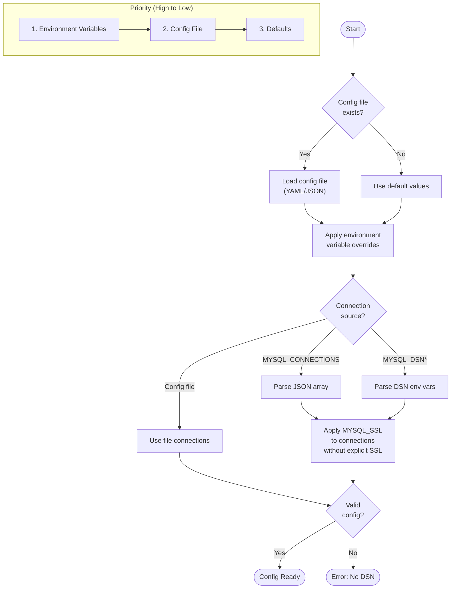

### Config File Search Order

The server searches for config files in the following order (first found wins):

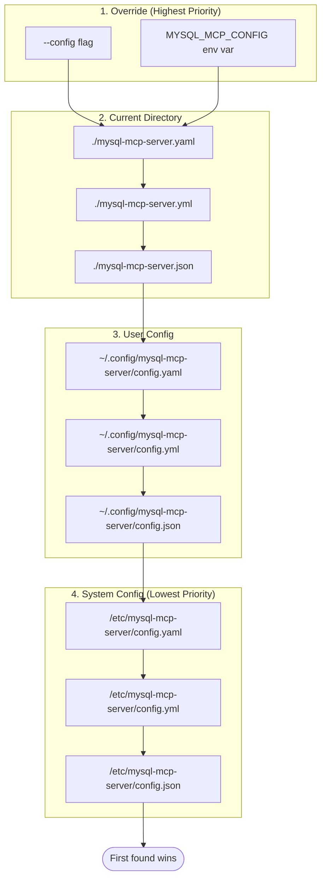

---

## Connection Management

The Connection Manager handles multiple database connections with connection pooling.

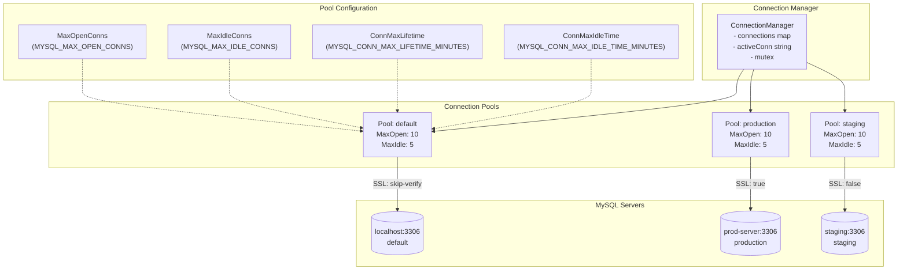

### Connection Selection Flow

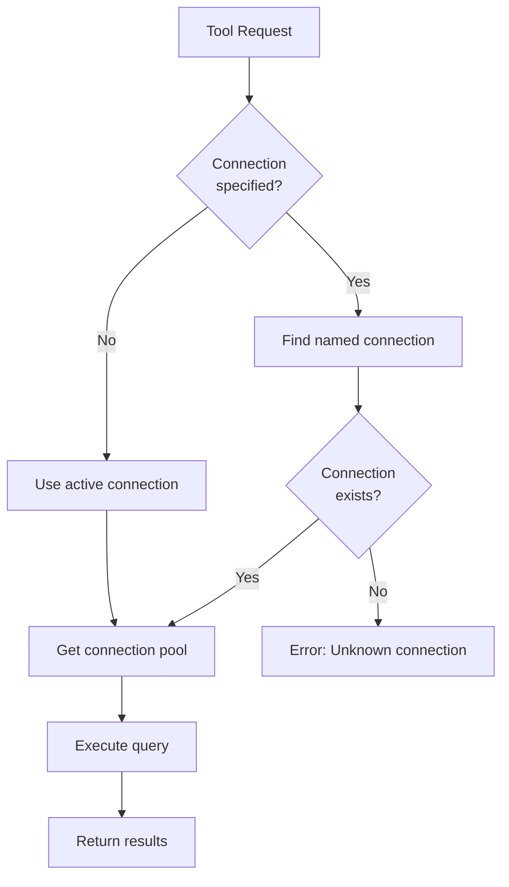

---

## Tool Categories

Tools are organized into three categories based on functionality.

```mermaid
graph TB
    subgraph "Core Tools (Always Available)"
        direction LR
        mysql_query["mysql_query<br/>Execute read-only SQL"]
        list_databases["list_databases<br/>Show all databases"]
        list_tables["list_tables<br/>Show tables in database"]
        describe_table["describe_table<br/>Show table structure"]
        ping["ping<br/>Test connection"]
        server_info["server_info<br/>MySQL version info"]
        list_connections["list_connections<br/>Show all DSNs"]
        use_connection["use_connection<br/>Switch active DSN"]
    end
    
    subgraph "Extended Tools (MYSQL_MCP_EXTENDED=1)"
        direction LR
        list_indexes["list_indexes"]
        show_create_table["show_create_table"]
        explain_query["explain_query"]
        list_views["list_views"]
        list_triggers["list_triggers"]
        list_procedures["list_procedures"]
        list_functions["list_functions"]
        list_partitions["list_partitions"]
        get_database_size["get_database_size"]
        get_table_sizes["get_table_sizes"]
        list_foreign_keys["list_foreign_keys"]
        show_status["show_status"]
        show_variables["show_variables"]
    end
    
    subgraph "Vector Tools (MYSQL_MCP_VECTOR=1)"
        direction LR
        vector_search["vector_search<br/>Similarity search"]
        get_vector_info["get_vector_info<br/>Vector column info"]
    end
    
    Core["Enable:<br/>Default"] --> mysql_query
    Extended["Enable:<br/>MYSQL_MCP_EXTENDED=1"] --> list_indexes
    Vector["Enable:<br/>MYSQL_MCP_VECTOR=1"] --> vector_search
```

---

## Security Architecture

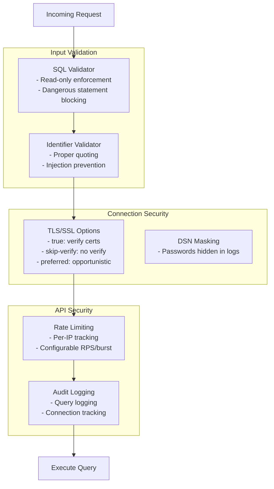

---

## Deployment Options

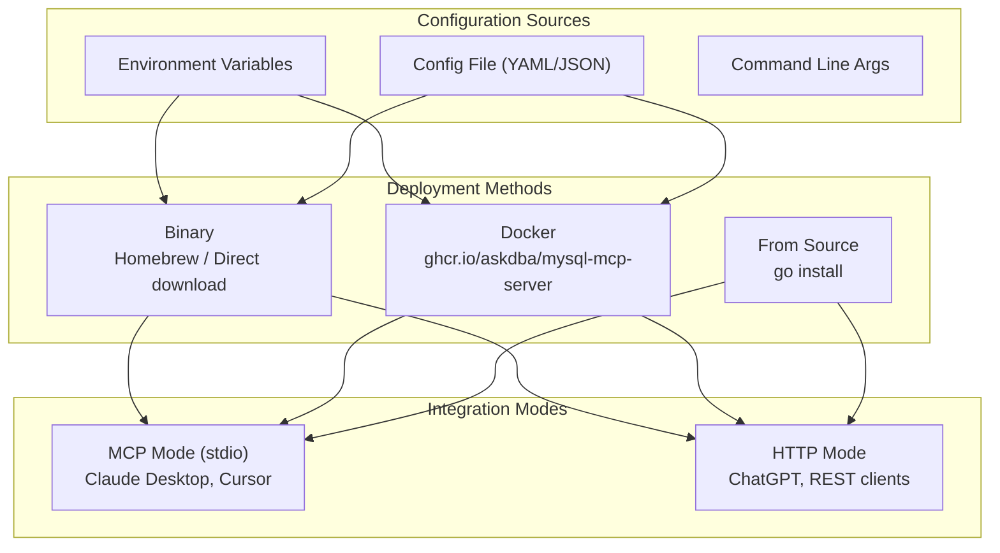

---

## Data Flow Summary

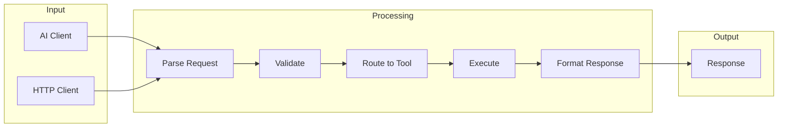

